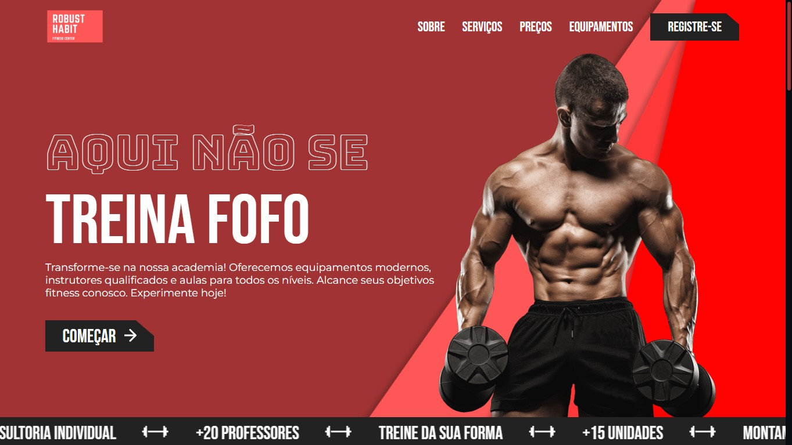

# Landing Page - Academia



## ✨ Sobre o projeto

Este projeto foi um desafio proposto pelo Futuro Dev - John, lá no Instagram dele, para ser entregue em alguns dias. Resolvi fazer por estudo e para colocar em prática meus conhecimentos. Não utilizei JavaScript, pois não achei tão necessário, então acabei usando somente HTML e CSS.

## 📚 Guia de Utilização:

1° Clone o repositório

```
git clone https://github.com/Fransuelton/fitness-gym-project.git
```

2° Caso não queira clonar o repositório, acesse o Deployment [clicando aqui](https://fransuelton.github.io/fitness-gym-project/).

## 📫 Contribuindo para o projeto:

Para contribuir com esse projeto, siga estas etapas:

1. Faça um fork deste repositório.
2. Crie um branch: `git checkout -b <nome_branch>`.
3. Faça suas alterações e confirme-as: `git commit -m '<mensagem_commit>'`
4. Envie para o repositório original: `git push origin <nome_branch>`
5. Crie a solicitação de pull.

## 📝 Créditos e Agradecimentos:

- Layout do Figma e Criador do desafio: Futuro Dev - John
- Criador da Página: [Fransuelton](https://www.linkedin.com/in/fransuelton/)

### Obrigado por visitar meu repositório!❤️